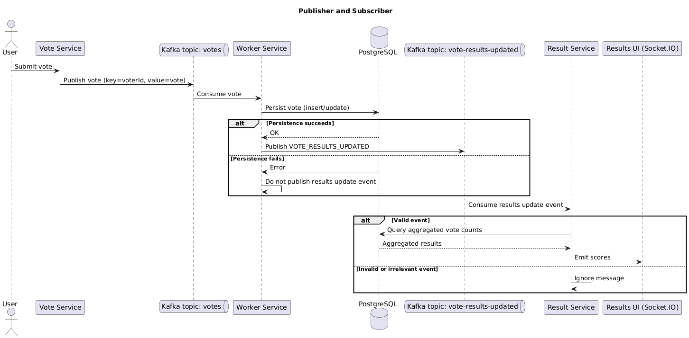
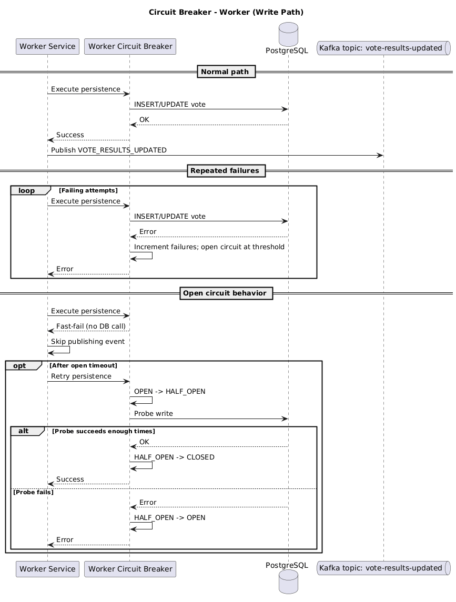
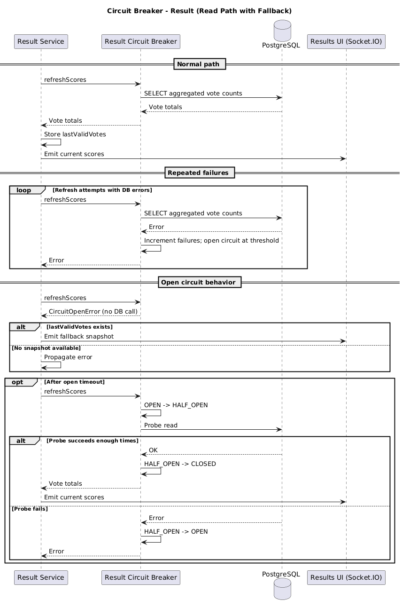

# 1. Portada

**Universidad:** Universidad ICESI
**Programa:** Ingeniería de Sistemas
**Curso:** Ingeniería de Software V
**Taller:** Taller 1 - Construcción de Pipelines en Cloud
**Integrantes:**

* Julio Antonio Prado (Operaciones)
* Juan Camilo Muñoz (Desarrollo)

**Docente:** Nicolas Echeverry
**Fecha de entrega:** 13 de abril
**Período académico:** 2026-1

# 2. Tabla de contenido

1. [Introducción](#3-introducción)
2. [Descripción del repositorio base](#4-descripción-del-repositorio-base)
3. [Metodología ágil seleccionada](#5-metodología-ágil-seleccionada)
4. [Estrategia de branching para desarrollo](#6-estrategia-de-branching-para-desarrollo)
5. [Estrategia de branching para operaciones](#7-estrategia-de-branching-para-operaciones)
6. [Patrones de diseño en la nube](#8-patrones-de-diseño-en-la-nube)
7. [Diagrama de arquitectura](#9-diagrama-de-arquitectura)
8. [Pipeline de desarrollo](#10-pipeline-de-desarrollo)
9. [Pipeline de infraestructura](#11-pipeline-de-infraestructura)
10. [Implementación de la infraestructura](#12-implementación-de-la-infraestructura)

# 3. Introducción

Este informe presenta el desarrollo del Taller 1 sobre construcción de pipelines en cloud a partir del repositorio `okteto/microservices-demo`, una aplicación distribuida de demostración compuesta por una interfaz de voto, Kafka, un servicio de procesamiento, PostgreSQL y una aplicación de resultados, con el objetivo de integrar decisiones de desarrollo y operaciones bajo un enfoque DevOps. En función de los criterios del enunciado, el trabajo abarca la selección de una metodología ágil, la definición de estrategias de branching para desarrollo y operaciones, la elección de patrones de diseño en la nube, la elaboración del diagrama de arquitectura y la preparación de la base técnica que soporta la automatización, la trazabilidad y el despliegue. En esta parte del informe se desarrollan específicamente la contextualización del sistema, la metodología de trabajo, la organización del equipo, las estrategias de branching, la selección de patrones y la arquitectura propuesta, como fundamento para las secciones posteriores dedicadas a pipelines, infraestructura, implementación y demostración del pipeline.

# 4. Descripción del repositorio base

## 4.1 Repositorio seleccionado

El proyecto seleccionado para el desarrollo del taller fue `okteto/microservices-demo`. El sistema implementa una aplicación de votación sencilla en la que un usuario puede elegir entre dos opciones (Tacos y Burritos) y posteriormente consultar los resultados. Aunque el caso de uso es simple, la arquitectura interna no es monolítica. La aplicación se compone de varios microservicios especializados, lo que permite observar un flujo de extremo a extremo típico de sistemas distribuidos: una interfaz captura la solicitud, un canal de mensajería desacopla el envío del procesamiento, un servicio intermedio actualiza el estado persistente y una interfaz separada expone los resultados consolidados.

## 4.2 Componentes principales identificados

A partir del análisis del repositorio y de la arquitectura base, se identificaron los siguientes elementos principales:

* **Aplicación de voto**: componente orientado al usuario que presenta el formulario de votación y recibe la selección.
* **Kafka**: middleware de mensajería utilizado para desacoplar el ingreso del voto del procesamiento posterior.
* **Worker**: servicio encargado de consumir eventos desde Kafka y persistir el resultado correspondiente.
* **PostgreSQL**: almacén persistente donde se guarda el estado consolidado de los votos.
* **Aplicación de resultados**: servicio web encargado de exponer y actualizar la visualización de los resultados.

## 4.3 Flujo funcional del sistema

El flujo observado en el repositorio puede resumirse de la siguiente manera: el usuario interactúa con la aplicación de voto; el voto es enviado como mensaje al broker Kafka; el servicio `worker` consume el mensaje y registra el resultado en PostgreSQL; finalmente, la aplicación de resultados consulta la base de datos usando polling y muestra el estado actualizado.

# 5. Metodología ágil seleccionada

## 5.1 Criterios de selección

La metodología de trabajo debía responder a cuatro restricciones concretas del taller: tiempo de ejecución corto, ausencia práctica de múltiples iteraciones, equipo reducido y necesidad de coordinar decisiones tanto de desarrollo como de operaciones. Bajo estas condiciones, no resultaba conveniente adoptar un marco con alta carga ceremonial o con demasiados artefactos formales, porque eso habría consumido tiempo que debía invertirse en diseñar arquitectura, preparar branching, construir pipelines y desplegar infraestructura.

Adicionalmente, desde DevOps era importante privilegiar el flujo de trabajo, la visibilidad de tareas, la reducción de bloqueos y la entrega incremental de artefactos verificables. El objetivo no era solamente “gestionar tareas”, sino sostener un proceso compatible con automatización, cambios frecuentes y coordinación efectiva entre roles técnicos. DevOps enfatiza precisamente la reducción del tiempo entre el cambio y la puesta en producción, conservando calidad en el resultado.

## 5.2 Metodologías evaluadas

Se consideraron cinco enfoques: **Scrum**, **Kanban**, **XP**, **Scrumban** y **Lean Software Development**. Scrum fue descartado como marco principal por su mayor carga en eventos y roles explícitos, poco conveniente para un equipo pequeño y un tiempo tan limitado. XP resultó valioso por sus prácticas técnicas, especialmente integración continua y validación automática, pero no como método rector porque el taller exige también decisiones de infraestructura, documentación y despliegue. Scrumban aparecía como un híbrido viable, aunque agregaba complejidad metodológica innecesaria para el tamaño del proyecto. Lean aportaba principios útiles, pero no un mecanismo operativo suficientemente concreto para la ejecución diaria del taller.

## 5.3 Metodología seleccionada

La metodología seleccionada fue **Kanban**. La elección responde a que Kanban permite visualizar el trabajo, limitar el paralelismo, gestionar bloqueos y mover tareas según capacidad real, sin requerir iteraciones formales, ceremonias extensas o estructuras difíciles de sostener en una ventana de ejecución corta. Esta flexibilidad es especialmente valiosa cuando la carga del proyecto está distribuida entre tareas de código, arquitectura, despliegue, automatización y documentación.

## 5.4 Aplicación concreta de Kanban al proyecto

La aplicación de Kanban se basó en un tablero con flujo explícito y políticas de avance claras. Las columnas utilizadas fueron: **Backlog**, **Pendiente**, **En desarrollo**, **En revisión** y **Terminado**. Las tareas se definieron de manera granular, asignando responsables y criterios de aceptación claros. Se establecieron límites de trabajo en curso para evitar sobrecarga y se promovió la colaboración entre desarrollo y operaciones para resolver bloqueos o dependencias. El tablero se mantuvo actualizado durante todo el proceso, sirviendo como herramienta central de coordinación y seguimiento.

## 5.5 Backlog de trabajo integrado al tablero

### Entregables de definición y diseño

1. **[Desarrollo] Documentar en el informe la metodología ágil seleccionada y su aplicación al proyecto**
   Redactar la justificación de la metodología elegida, explicando cómo se usó en el desarrollo del taller y su relación con el trabajo conjunto entre desarrollo y operaciones.

2. **[Desarrollo] Documentar en el informe la estrategia de branching para desarrollo**
   Definir y justificar la estrategia de ramas para cambios funcionales sobre `vote`, `worker` y `result`, alineada con integración continua y control de cambios.

3. **[Operaciones] Documentar en el informe la estrategia de branching para operaciones**
   Definir y justificar la estrategia de ramas para cambios sobre despliegue, configuración e infraestructura.

4. **[Desarrollo] Documentar en el informe los patrones cloud seleccionados y su justificación técnica**
   Sustentar la elección de **Publisher and Subscriber** y **Circuit Breaker** en función de la arquitectura del sistema y de los problemas identificados en el flujo de resultados y en el acceso a base de datos.

5. **[Operaciones] Elaborar el diagrama de arquitectura final del sistema con los patrones incorporados**
   Construir el diagrama de despliegue/componentes del sistema mostrando `vote`, `kafka`, `worker`, `result` y `db`, junto con los elementos añadidos para mensajería de resultados y protección de acceso a PostgreSQL.

### Cambios funcionales y arquitectónicos sobre el sistema

6. **[Desarrollo] Implementar la publicación de eventos de actualización de resultados desde el `worker`**
   Modificar el flujo del servicio `worker` para que, después de persistir un voto, publique un evento de actualización hacia Kafka.

7. **[Desarrollo] Implementar la suscripción a eventos de actualización en `result-application`**
   Incorporar en la aplicación de resultados la recepción de eventos provenientes de Kafka para reaccionar a cambios en el conteo.

8. **[Desarrollo] Ajustar `result-application` para reducir la dependencia de polling continuo a PostgreSQL**
   Adaptar la lógica de actualización de resultados para que el refresco se dispare a partir de eventos de actualización y no únicamente por consulta repetitiva a la base de datos.

9. **[Desarrollo] Implementar Circuit Breaker en la ruta de lectura de resultados hacia PostgreSQL**
   Incorporar una capa de protección entre `result-application` y la base de datos para manejar fallos o latencia persistente en la dependencia remota.

10. **[Desarrollo] Implementar Circuit Breaker en la ruta de escritura del `worker` hacia PostgreSQL**
    Incorporar una capa de protección entre `worker` y la base de datos para evitar propagación de errores durante la persistencia de votos.

### Automatización y pipelines

11. **[Desarrollo] Construir el pipeline de desarrollo para validación, build y generación de imágenes de `vote`, `worker` y `result`**
    Automatizar la validación técnica de los servicios, su construcción y el empaquetado de imágenes versionadas y trazables.

12. **[Desarrollo] Integrar la publicación de imágenes al registro dentro del pipeline de desarrollo**
    Dejar automatizada la generación y publicación de artefactos para que luego puedan ser desplegados por la capa operativa.

13. **[Operaciones] Construir el pipeline de infraestructura para validar y desplegar la solución**
    Automatizar la validación de manifiestos o scripts operativos y la promoción del despliegue del entorno.

14. **[Operaciones] Parametrizar el despliegue para consumir las imágenes generadas por el pipeline de desarrollo**
    Conectar el pipeline de infraestructura con los artefactos generados en desarrollo, garantizando trazabilidad entre build y despliegue.

### Infraestructura y despliegue

15. **[Operaciones] Implementar el despliegue de PostgreSQL, Kafka y los servicios de aplicación en el entorno objetivo**
    Desplegar la infraestructura necesaria para ejecutar la arquitectura definida con los servicios `vote`, `worker`, `result`, Kafka y PostgreSQL.

16. **[Operaciones] Configurar la comunicación entre servicios y la exposición mínima necesaria del sistema desplegado**
    Dejar operativa la conectividad entre los componentes internos y la exposición requerida para el uso y validación del sistema.

17. **[Operaciones] Validar el entorno desplegado con foco en conectividad, disponibilidad y ejecución del flujo completo de voto**
    Verificar que el sistema permita votar, procesar el evento, persistir el resultado y mostrar la actualización correspondiente.

# 6. Estrategia de branching para desarrollo

## 6.1 Justificación para este proyecto

GitHub Flow fue la mejor opción para desarrollo porque el proyecto no requiere mantener múltiples versiones del producto en paralelo ni ciclos largos de release. El equipo necesitaba una estrategia ligera que permitiera hacer cambios concretos sobre el repositorio, validarlos por medio del pipeline y fusionarlos rápidamente a una rama estable. En ese contexto, usar otras estrategias como trunk-based development imponía una disciplina mayor sobre el trunk que no aportaba una ventaja clara para un equipo de este tamaño. 

## 6.2 Estructura de ramas propuesta

La estrategia adoptada para desarrollo se definió así:

* `main`: rama estable del proyecto, siempre en estado desplegable o integrable.
* `feature/<nombre-cambio>`: ramas cortas para nuevas funcionalidades o ajustes visibles.
* `bugfix/<nombre-cambio>`: ramas cortas para corrección de defectos.

En el historial del repositorio se observan ramas como `feature/dev-pipeline-base`, `feature/circuit-breaker-postgres` y `feature/pubsub-results-events`, integradas luego a `main`.

## 6.3 Flujo de trabajo

El flujo propuesto es el siguiente:

1. Crear la rama a partir de `main`.
2. Implementar el cambio de manera aislada.
3. Ejecutar validaciones locales mínimas.
4. Publicar la rama remota y abrir solicitud de integración.
5. Ejecutar pipeline de desarrollo sobre la rama.
6. Revisar el resultado del pipeline y corregir si es necesario.
7. Integrar en `main` únicamente cuando el cambio esté validado.
8. Eliminar la rama corta una vez fusionada.

## 6.4 Reglas de integración

Se definieron las siguientes reglas para fusionar cambios hacia `main`:

* Ningún cambio entra directamente a `main` sin pasar por rama corta.
* Todo cambio funcional debe tener revisión técnica mínima.
* Todo cambio debe ejecutar el pipeline de desarrollo.
* No se integran ramas con errores de compilación, pruebas fallidas o inconsistencias evidentes con el diseño.
* Los cambios de documentación pueden seguir un flujo más ligero, pero deben conservar trazabilidad.

# 7. Estrategia de branching para operaciones

## 7.1 Criterio de selección

Para el frente de operaciones se seleccionó una **adaptación de GitLab Flow para infraestructura**, utilizando ramas de entorno junto con ramas cortas para cambios operativos. La referencia consultada describe GitLab Flow como un enfoque que combina ramas de trabajo con ramas alineadas a ambientes, por ejemplo una rama principal, una de staging y una de producción, lo que facilita promover cambios de manera controlada entre contextos. 

## 7.2 Justificación para este proyecto

A diferencia del código de aplicación, los cambios de operaciones afectan manifiestos, configuraciones de despliegue, scripts y definiciones de infraestructura. Estos artefactos tienen una sensibilidad distinta: un error de configuración puede dejar sin servicio a varios componentes a la vez o impedir el aprovisionamiento correcto del entorno. Por esa razón, se consideró conveniente una estrategia más trazable que la usada en desarrollo, con una ruta explícita de validación antes de considerar un cambio como apto para producción.

## 7.3 Estructura de ramas propuesta

La estrategia definida para operaciones fue:

* `main`: rama de referencia para configuraciones base, templates y artefactos estables de infraestructura.
* `staging`: rama para validar cambios operativos antes de promoverlos.
* `production`: rama reservada para infraestructura aprobada y lista para despliegue estable.
* `infra/<nombre-cambio>`: ramas cortas para cambios en IaC, despliegue o aprovisionamiento.
* `opsfix/<nombre-ajuste>`: ramas rápidas para corrección urgente en scripts o manifiestos.

## 7.4 Flujo de trabajo

El flujo de trabajo planteado fue el siguiente:

1. Crear la rama operativa corta desde `main`.
2. Realizar el cambio sobre scripts, manifiestos o archivos de infraestructura.
3. Validar sintaxis y consistencia localmente.
4. Integrar en `staging` para validación en pipeline de infraestructura.
5. Revisar resultados del pipeline y del entorno.
6. Promover a `production` una vez aprobado el cambio.
7. Mantener registro del cambio y evidencia de despliegue.

Este flujo permite diferenciar claramente entre edición, validación e incorporación final.

## 7.5 Reglas de promoción entre ramas

Para evitar inconsistencias, se definieron estas reglas:

* Los cambios operativos no pasan directamente a `production`.
* Toda modificación debe validarse previamente en `staging`.
* Los cambios sobre infraestructura deben conservar trazabilidad respecto al problema que resuelven.
* Los scripts y manifiestos deben tratarse como código y quedar bajo control de versiones, con revisión técnica antes de su promoción.

# 8. Patrones de diseño en la nube

## 8.1 Criterios de selección

La selección de patrones se realizó a partir de dos observaciones principales sobre el sistema base y la arquitectura derivada. La primera fue que el sistema ya contaba con una capa de mensajería para desacoplar el ingreso del voto del procesamiento, pero la actualización de resultados hacia la aplicación de consulta seguía siendo una oportunidad clara para mejorar desacoplamiento y reactividad. La segunda fue que PostgreSQL aparecía como una dependencia compartida y crítica, tanto para lectura como para escritura, por lo que cualquier degradación en su disponibilidad afectaría directamente la estabilidad de `result-app` y `worker`.

Con base en estas observaciones, se escogieron dos patrones:

## 8.2 Patrón 1: Publisher and Subscriber

### 8.2.1 Problema identificado

En la arquitectura original, el principal problema en la capa de resultados era que `result-application` dependía de realizar **polling continuo sobre la base de datos** cada vez que necesitaba conocer el conteo más reciente de votos. Este enfoque hacía que la actualización de resultados dependiera de consultas repetidas a PostgreSQL, incluso cuando no existían cambios nuevos, generando acoplamiento innecesario entre la visualización y la persistencia, además de introducir una carga constante sobre la base de datos.

### 8.2.2 Justificación de aplicabilidad

Se seleccionó **Publisher and Subscriber** porque permite sustituir ese esquema de polling por un mecanismo de **notificación basada en eventos**. En este enfoque, el `worker`, después de procesar un voto y persistirlo, publica un evento indicando que el conteo fue actualizado; posteriormente, `result-application` se suscribe a ese evento y reacciona cuando realmente ocurre un cambio. El valor del patrón no estuvo en incorporar mensajería donde no existía, sino en **eliminar la necesidad de consultar repetidamente la base de datos para detectar cambios**, trasladando la actualización de resultados hacia un modelo reactivo y desacoplado.

### 8.2.3 Componentes involucrados

En la arquitectura final, el patrón se reflejó mediante:

* `ResultsUpdatePublisher` dentro del nodo `worker`
* `VoteResultsEventTopic` dentro del nodo `kafka`
* `ResultsUpdateSubscriber` dentro del nodo `result-application`

Estos componentes se añadieron para representar explícitamente el flujo de publicación y suscripción encargado de notificar cambios en el conteo de votos.

### 8.2.4 Beneficio esperado

El principal beneficio es la **eliminación del polling continuo desde `result-application` hacia la base de datos**. En lugar de consultar repetidamente PostgreSQL para verificar si el conteo cambió, el sistema ahora recibe una notificación cuando existe una actualización relevante. Esto reduce carga innecesaria sobre la base de datos, disminuye el acoplamiento temporal entre la lectura y la persistencia, y hace más clara la orientación asíncrona de la arquitectura.

### 8.2.5 Implementación actual en el repositorio

La implementación actual de Publisher and Subscriber está concentrada en dos puntos concretos. En `worker/main.go`, el ciclo que procesa `consumer.Messages()` toma `msg.Key` y `msg.Value`, persiste el voto mediante `persistVoteAndPublishUpdate(...)` y luego publica el evento con `publishResultsUpdated(...)`. Ese evento se construye con la estructura `voteResultsUpdatedEvent` e incluye explícitamente `type`, `source`, `voterId`, `vote` y `updatedAt`; el `type` se fija como `VOTE_RESULTS_UPDATED` y el tópico destino se resuelve desde `RESULTS_UPDATED_TOPIC` (por defecto `vote-results-updated`).

En `result/server.js`, el arranque del servicio ejecuta `startResultsUpdateConsumer(...)` con `resultsTopic` y un callback `onResultsUpdated` que invoca `refreshScores()`. Dentro de `result/kafka-consumer.js`, la función `handleResultsUpdateMessage(...)` parsea el mensaje y solo dispara el callback cuando `event.type === 'VOTE_RESULTS_UPDATED'`; mensajes inválidos o de otro tipo se descartan. Esto deja el flujo reactivo conectado de extremo a extremo: publicación en `worker`, suscripción en `result` y refresco inmediato de conteos.

### 8.2.6 Archivos del repositorio relacionados

* [worker/main.go](../worker/main.go)
* [worker/worker_flow_test.go](../worker/worker_flow_test.go)
* [result/server.js](../result/server.js)
* [result/kafka-consumer.js](../result/kafka-consumer.js)
* [result/kafka-consumer.test.js](../result/kafka-consumer.test.js)

### 8.2.6 Diagrama de secuencia del patrón Publisher and Subscriber

## 8.3 Patrón 2: Circuit Breaker

### 8.3.1 Problema identificado

PostgreSQL es una dependencia central del sistema. Tanto `worker` como `result-app` interactúan con la base de datos, uno para escritura y otro para lectura. Si la base de datos presenta latencia o falla sostenida, ambos servicios podrían seguir intentando acceder a ella, provocando esperas innecesarias, saturación de recursos y propagación del error.

### 8.3.2 Justificación de aplicabilidad

Se seleccionó **Circuit Breaker** porque se adapta directamente al escenario de llamadas remotas hacia una dependencia posiblemente degradada. Azure establece que este patrón ayuda a evitar que una aplicación repita llamadas que probablemente seguirán fallando y que su objetivo es mejorar estabilidad y resiliencia frente a recursos remotos con recuperación variable. 

### 8.3.3 Componentes involucrados

En la arquitectura final, el patrón se materializó con dos componentes locales al consumidor de la dependencia:

* `ResultDbCircuitBreaker` dentro de `result-application`
* `WorkerDbCircuitBreaker` dentro de `worker`

La decisión de representarlos como componentes internos y no como un nodo central compartido se tomó porque el patrón opera del lado del cliente que invoca a la dependencia remota, no como un servicio autónomo separado.

### 8.3.4 Beneficio esperado

El beneficio esperado es doble. En `result-app`, el patrón evita insistir sobre PostgreSQL cuando el sistema de lectura se encuentra degradado. En `worker`, protege la ruta de escritura cuando la base de datos no puede absorber correctamente las inserciones. En ambos casos, el patrón mejora la resiliencia del sistema y hace visible una preocupación de tolerancia a fallos dentro del diseño.

### 8.3.5 Implementación actual en el repositorio

La implementación actual de Circuit Breaker se ve de forma explícita en ambos servicios. En `worker/main.go`, `NewVoteStore(...)` recibe `VoteStoreConfig` con valores de `CB_FAILURE_THRESHOLD`, `CB_OPEN_TIMEOUT_MS`, `CB_HALF_OPEN_SUCCESS_THRESHOLD` y `DB_OPERATION_TIMEOUT_MS`. En `worker/store.go`, `SaveVote(...)` ejecuta el `INSERT ... ON CONFLICT` dentro de `breaker.Execute(...)` y usa `ExecContext(...)` con `context.WithTimeout(...)` para que un timeout de base de datos cuente como fallo del circuito. La máquina de estados (`Closed`, `Open`, `HalfOpen`) y las transiciones con fast-fail están implementadas en `worker/breaker.go`.

En `result/server.js`, se instancia `new CircuitBreaker(...)` con los mismos parámetros de entorno y se delega la lectura en `createResultsRefresher(...)`. En `result/results-refresher.js`, `refreshScores()` ejecuta `resultsRepository.getVoteCounts(...)` dentro de `resultsBreaker.execute(...)`; si recibe `CircuitOpenError` y existe `lastValidVotes`, emite ese snapshot por `emitScores(...)` como fallback. Esta lógica evita caída total del servicio y mantiene respuesta para el frontend durante ventanas de degradación.

### 8.3.6 Archivos del repositorio relacionados

* [worker/breaker.go](../worker/breaker.go)
* [worker/store.go](../worker/store.go)
* [worker/main.go](../worker/main.go)
* [worker/worker_flow_test.go](../worker/worker_flow_test.go)
* [result/circuit-breaker.js](../result/circuit-breaker.js)
* [result/results-refresher.js](../result/results-refresher.js)
* [result/results-refresher.test.js](../result/results-refresher.test.js)

### 8.3.6 Diagrama de secuencia del patrón Circuit Breaker

#### Flujo de escritura en `worker` con Circuit Breaker

#### Flujo de lectura en `result` con Circuit Breaker

# 9. Diagrama de arquitectura

El diagrama final representa el sistema como un conjunto de unidades de despliegue lógicas que agrupan sus componentes internos de responsabilidad. El nodo `voting-application` contiene `VotingUI`, `VotingController` y `PendingVoteProducer`, reflejando la captura del voto y su publicación al broker. El nodo `kafka` reúne `KafkaBroker`, `PendingVotesTopic` y `VoteResultsEventTopic`, mostrando tanto el flujo original de votos como el nuevo canal de actualización de resultados. El nodo `worker` integra `PendingVoteConsumer`, `Worker`, `ResultsUpdatePublisher`, `WorkerDbCircuitBreaker` y `WorkerDbClient`, evidenciando que el procesamiento de votos, la emisión de eventos y la persistencia se ejecutan dentro del mismo servicio, pero con responsabilidades diferenciadas. Finalmente, `result-application` contiene `VoteResultsUI`, `VoteResultsServer`, `ResultsUpdateSubscriber`, `ResultDbCircuitBreaker` y `ResultDbClient`, expresando la transición desde un esquema de polling hacia una reacción basada en eventos, sin perder la consulta a PostgreSQL como fuente de verdad del conteo.

La arquitectura definida materializa directamente los dos patrones seleccionados. Publisher and Subscriber queda visible en la relación entre `ResultsUpdatePublisher`, `KafkaBroker`, `VoteResultsEventTopic` y `ResultsUpdateSubscriber`, lo que permite notificar cambios de estado sin acoplar `worker` con `result-application`. Circuit Breaker aparece mediante los componentes `ResultDbCircuitBreaker` y `WorkerDbCircuitBreaker`, ubicados del lado cliente en las rutas de lectura y escritura hacia PostgreSQL, con el fin de contener fallos o latencia persistente de la base de datos. De esta manera, el diagrama no solo describe la estructura del sistema, sino que también evidencia cómo las decisiones arquitectónicas se traducen en componentes concretos que soportan resiliencia, desacoplamiento y preparación para automatización.

## 9.1 Mapeo del diagrama de despliegue a la implementación real

Para que la relación entre arquitectura y código sea verificable, el mapeo se presenta por componente del diagrama y su implementación concreta en el repositorio.

* **`VotingUI` (voting-application)**: plantilla web de voto en `vote/src/main/resources/templates/index.html`. El formulario `method="POST" action="/"` materializa la interacción `postVote` del diagrama.
* **`VotingController` (voting-application)**: clase `VoteController` en `vote/src/main/java/com/okteto/vote/controller/VoteController.java`. `index(...)` atiende la carga de la vista (`renderVoteForm`) y `postForm(...)` procesa el voto (`postVote`).
* **`PendingVoteProducer` (voting-application)**: en `VoteController.postForm(...)`, la llamada `kafkaTemplate.send(kafkaTopic, voter, vote)` implementa `sendVote`. La configuración del productor está en `vote/src/main/java/com/okteto/vote/kafka/KafkaProducerConfig.java`.
* **`KafkaBroker` + `PendingVotesTopic` (kafka)**: el tópico de entrada se define por `PENDING_VOTES_TOPIC` (default `votes`) y se consume en `worker/main.go` con `ConsumePartition(*topic, ...)`, representando `consumePendingVote`.
* **`PendingVoteConsumer` (worker)**: `worker/main.go` recibe mensajes en el bloque `case msg := <-consumer.Messages()` y extrae `msg.Key`/`msg.Value`.
* **`Worker` (worker)**: la orquestación principal está en `persistVoteAndPublishUpdate(...)`, que separa persistencia de voto y publicación del evento de actualización.
* **`ResultsUpdatePublisher` + `VoteResultsEventTopic` (worker/kafka)**: `publishResultsUpdated(...)` en `worker/main.go` construye el evento `VOTE_RESULTS_UPDATED` y publica en `RESULTS_UPDATED_TOPIC` (default `vote-results-updated`), que corresponde a `publishResultUpdatedEvent`.
* **`WorkerDbCircuitBreaker` (worker)**: implementado en `worker/breaker.go` (`CircuitBreaker.Execute(...)`) y aplicado en `worker/store.go` dentro de `VoteStore.SaveVote(...)`.
* **`WorkerDbClient` (worker)**: acceso a PostgreSQL en `worker/store.go` mediante `db.ExecContext(...)` con `INSERT ... ON CONFLICT` sobre la tabla `votes`.
* **`VoteResultsServer` (result-application)**: servidor Express/Socket.IO en `result/server.js`; expone `/`, inicializa `refreshScores()` y emite resultados por socket.
* **`ResultsUpdateSubscriber` (result-application)**: suscripción Kafka en `result/kafka-consumer.js` con `startResultsUpdateConsumer(...)`; `handleResultsUpdateMessage(...)` filtra por `event.type === 'VOTE_RESULTS_UPDATED'` y dispara `notifyResultsUpdated`.
* **`ResultDbCircuitBreaker` (result-application)**: instancia de `CircuitBreaker` en `result/server.js`, usada por `createResultsRefresher(...)` en `result/results-refresher.js` para envolver la lectura.
* **`ResultDbClient` (result-application)**: `ResultsRepository` en `result/results-repository.js`, donde `getVoteCounts(...)` ejecuta la consulta SQL de agregación por voto.
* **`VoteResultsUI` (result-application)**: interfaz en `result/views/index.html` y lógica en `result/views/app.js`; `socket.on('scores', ...)` implementa `renderUpdatedResults`.

# 10. Pipeline de desarrollo

## 10.1 Objetivo del pipeline de desarrollo

El pipeline de desarrollo se diseñó para transformar cambios en el código fuente de `vote`, `worker` y `result` en artefactos versionados, trazables y listos para despliegue. Su objetivo es automatizar la validación técnica de los servicios, su construcción y el empaquetado en imágenes de contenedor, de forma que cada cambio funcional que llegue a una rama de desarrollo produzca una salida consistente y reutilizable por el pipeline de infraestructura. La lógica general del pipeline responde a un flujo de integración continua: primero se verifica que los tres servicios se encuentren en un estado construible; después se empaquetan como imágenes; finalmente se publican en un registro para que operaciones pueda consumirlas sin depender del repositorio fuente durante el despliegue.

Desde la perspectiva del proyecto, este pipeline cubre el frente de automatización asociado exclusivamente al software de aplicación. No aprovisiona Kafka ni PostgreSQL, ni ejecuta despliegues al entorno objetivo; en cambio, garantiza que `vote`, `worker` y `result` puedan convertirse en artefactos listos para usarse y que esos artefactos queden identificados por commit, ejecución o versión de build. Esta separación fue adoptada para que el equipo de desarrollo se concentre en calidad del cambio y generación de imágenes, mientras el equipo de operaciones se encarga de la promoción y despliegue controlado de esos mismos artefactos.

## 10.2 Diseño general y conexión con el flujo DevOps

El pipeline de desarrollo se ejecuta ante cambios en ramas funcionales o solicitudes de integración que afecten los servicios de aplicación. Su papel en el flujo DevOps es el de productor de artefactos: toma el código, lo verifica y produce imágenes de contenedor con tags trazables. Estas imágenes se convierten en la salida oficial del pipeline y en la entrada del pipeline de infraestructura. La trazabilidad entre ambos pipelines se mantiene registrando, al final del proceso, qué imagen corresponde a cada servicio, con qué tag fue publicada y qué commit la originó. En consecuencia, la relación entre ambos flujos no se apoya en referencias manuales, sino en artefactos versionados que operaciones puede consumir de manera declarativa.

## 10.3 Etapas del pipeline de desarrollo

La primera etapa corresponde a la **obtención del código**. En esta fase se hace checkout de la rama objetivo y se resuelve el contexto de ejecución del pipeline. A partir de ahí se activa la capa de validación.

La segunda etapa es la **validación técnica de los servicios**. Dado que el proyecto combina varias tecnologías, esta fase se adapta al contexto de cada servicio. Para `vote`, el pipeline debe ejecutar su proceso de build o validación propia del stack Java; para `worker`, debe verificar que el servicio Go compile correctamente; y para `result`, debe instalar dependencias y comprobar que el servicio Node.js sea construible o ejecutable. La intención de esta etapa no es realizar una batería extensa de pruebas funcionales, sino asegurar que el cambio introducido no rompa la capacidad básica de construir los tres servicios.

La tercera etapa es el **build por servicio**. Superada la validación, el pipeline prepara el empaquetado individual de `vote`, `worker` y `result`. Esta separación es importante porque permite detectar con precisión qué componente falla y evita que un error en un servicio oculte el comportamiento de los demás.

La cuarta etapa es la **construcción de imágenes**. En esta fase se ejecutan los Dockerfiles o definiciones equivalentes de cada servicio para generar una imagen de contenedor por componente. Las imágenes se etiquetan con un valor trazable, por ejemplo el hash corto del commit o un identificador del build. La decisión de etiquetarlas de manera consistente es crítica, porque luego el pipeline de infraestructura debe consumir exactamente esas versiones y no una mezcla de builds previos.

La quinta etapa es la **publicación de artefactos**. Las imágenes generadas se publican en un registro de contenedores, como GHCR o Docker Hub, que actúa como artifact store del flujo. En este punto, el pipeline deja de trabajar sobre código fuente y pasa a trabajar sobre artefactos listos para ser desplegados. Junto con las imágenes, se registra la relación entre servicio, tag e identificador del commit, lo que permite rastrear posteriormente qué build fue promovido a despliegue.

La sexta etapa es la **emisión del resultado del build**. El pipeline debe producir una salida estructurada con la información mínima necesaria para operaciones: imagen de `vote`, imagen de `worker`, imagen de `result`, tag de cada una, rama de origen y commit asociado. Esta salida constituye el punto de enlace con el pipeline de infraestructura.

## 10.4 Herramientas y organización de archivos

El pipeline de desarrollo se apoya en GitHub Actions como orquestador y en scripts de validación por servicio para mantener una separación clara de responsabilidades. Conceptualmente, esta organización divide el flujo en tres capas: validación técnica de cada componente, construcción de artefactos y publicación de imágenes.

La carpeta `scripts/ci/` cumple el rol de estandarizar cómo se valida cada servicio según su stack, mientras el workflow central coordina orden, dependencias y resultados. Esta combinación permite que la lógica del pipeline sea mantenible y trazable: el archivo de workflow describe el proceso de CI/CD y los scripts encapsulan las reglas de validación de aplicación.

## 10.5 Artefactos generados y trazabilidad

Los artefactos del pipeline son tres imágenes de contenedor, una por servicio de aplicación (`vote`, `worker`, `result`), publicadas en GHCR cuando el flujo corresponde a integración efectiva. La trazabilidad se basa en tres tipos de etiqueta: una etiqueta por commit (`sha-...`) para identificar la versión exacta del cambio, una etiqueta por rama (`branch-...`) para seguir la evolución del trabajo en curso y una etiqueta `latest` únicamente para la rama principal.

Este esquema permite separar identificación técnica y uso operativo. La etiqueta por commit sostiene auditoría y reproducibilidad; la etiqueta por rama facilita seguimiento durante desarrollo; y la etiqueta `latest` se reserva como referencia de la versión más reciente integrada en `main`. En conjunto, estas etiquetas conectan de forma explícita el resultado del build con el despliegue posterior.

## 10.6 Pruebas realizadas para validación del comportamiento

En esta implementación se incluyó una base de pruebas para validar comportamiento, aun cuando el taller no lo exigía de forma explícita. La decisión responde a un criterio de ingeniería de software y de prácticas CI/CD: un pipeline de desarrollo no debe limitarse a compilar y empaquetar, también debe verificar que el sistema preserve el comportamiento esperado después de cada cambio.

Desde esa perspectiva, las pruebas funcionan como evidencia técnica previa a la promoción de artefactos. Su propósito no es aumentar complejidad, sino reducir riesgo de regresiones en los flujos que sostienen la arquitectura final: procesamiento de votos, actualización reactiva de resultados y tolerancia a fallos frente a base de datos.

### 10.6.1 Escenarios de validación cubiertos

1. **Servicio `result`**
   1. **Actualización por evento válido**: se valida que, cuando llega un evento `VOTE_RESULTS_UPDATED`, el servicio ejecute el refresco de resultados. Este caso confirma que el flujo reactivo de resultados responde al evento de dominio correcto.
   2. **Filtrado de mensajes no válidos**: se valida que mensajes mal formados o eventos de otro tipo no disparen actualización. Este caso evita refrescos falsos y protege la estabilidad del consumidor frente a ruido en el tópico.
   3. **Apertura del Circuit Breaker en lectura**: se valida que, ante fallos consecutivos de base de datos, el circuito pase a estado abierto. Este comportamiento es clave para evitar reintentos costosos durante una degradación sostenida.
   4. **Continuidad con snapshot en circuito abierto**: se valida que, si ya existe un último estado válido y el circuito está abierto, el servicio use ese snapshot como respuesta de continuidad sin insistir en una consulta que seguirá fallando.
   5. **Recuperación controlada del Circuit Breaker**: se valida la transición de `OPEN` a `HALF_OPEN` y luego a `CLOSED` cuando la dependencia se recupera. Este caso demuestra que la estrategia no solo bloquea, también restablece operación normal de forma progresiva.

2. **Servicio `worker`**
   1. **Persistencia exitosa seguida de publicación**: se valida que, cuando el voto se persiste correctamente, se publique exactamente un evento de actualización con información de dominio consistente (`type`, `source`, `voterId`, `vote`, `updatedAt`). Este caso asegura coherencia entre procesamiento interno y notificación externa.
   2. **No publicación ante fallo de persistencia**: se valida que, si la persistencia falla, no se publique evento de actualización. Este comportamiento evita propagar al ecosistema una actualización que realmente no quedó consolidada en base de datos.
   3. **Apertura y fast-fail del Circuit Breaker en escritura**: se valida que, tras fallos consecutivos en escritura, el circuito se abra y rechace rápidamente nuevas operaciones mientras permanezca en ese estado.

3. **Servicio `vote`**
   No se incorporaron casos de prueba específicos para `vote`, porque el objetivo de esta base de validación fue comprobar el comportamiento de los patrones introducidos (Publisher/Subscriber y Circuit Breaker), implementados y ejercidos principalmente en `worker` y `result`.

## 10.7 Implementación del pipeline de desarrollo en el repositorio

La implementación del pipeline está organizada en cuatro jobs que reflejan el flujo del proyecto: `validate-vote`, `validate-worker`, `validate-result` y `build-images`. Los tres primeros funcionan como compuertas de calidad por servicio y ejecutan scripts dedicados en `scripts/ci/`, con validaciones acordes a cada stack. En términos prácticos, `vote` valida su capacidad de build, `worker` valida compilación y pruebas, y `result` valida instalación de dependencias, pruebas y verificación sintáctica.

El job `build-images` depende de la finalización exitosa de esas validaciones y construye imágenes de forma homogénea para `vote`, `worker` y `result` mediante una estrategia matricial. Antes de construir, calcula metadatos de imagen a partir de commit y rama para producir las etiquetas operativas (`sha`, `branch` y `latest` en `main`). Con esto, la salida del pipeline no es solo una imagen construida, sino una imagen identificable y utilizable en promoción posterior.

En cuanto a publicación, el pipeline diferencia claramente validación de promoción: en `pull_request` construye para verificar integrabilidad, pero no publica; en eventos `push` sí habilita autenticación y publicación a GHCR. Esta separación soporta el modelo de branching definido en el informe, porque permite validar cambios de `feature/*` y `bugfix/*` sin perder trazabilidad y, al mismo tiempo, publicar artefactos cuando el cambio entra al flujo de integración.

Finalmente, la lógica de scripts mantiene el pipeline desacoplado de detalles de lenguaje. El workflow coordina dependencias y resultados, mientras cada script encapsula su criterio técnico de validación. Esta estructura facilita mantenimiento, evolución y reproducibilidad local del mismo proceso que corre en CI.

## 10.8 Archivos del repositorio relacionados

* [.github/workflows/dev-pipeline.yml](../.github/workflows/dev-pipeline.yml)
* [scripts/ci/validate-vote.sh](../scripts/ci/validate-vote.sh)
* [scripts/ci/validate-worker.sh](../scripts/ci/validate-worker.sh)
* [scripts/ci/validate-result.sh](../scripts/ci/validate-result.sh)
* [vote/Dockerfile](../vote/Dockerfile)
* [worker/Dockerfile](../worker/Dockerfile)
* [result/Dockerfile](../result/Dockerfile)

# 11. Pipeline de infraestructura

## 11.1 Objetivo del pipeline de infraestructura

El pipeline de infraestructura se diseñó para tomar las imágenes generadas por el pipeline de desarrollo y convertirlas en un sistema desplegado y operativo, compuesto por PostgreSQL, Kafka, `vote`, `worker` y `result`. Su función principal es automatizar la validación de manifiestos y configuraciones operativas, inyectar los artefactos correctos en el despliegue y aplicar la infraestructura necesaria para que la solución definida en la arquitectura pueda ejecutarse. En otras palabras, este pipeline no produce software nuevo; consume artefactos ya construidos y los promueve a un entorno real de ejecución.

## 11.2 Rol dentro del flujo DevOps

Dentro del flujo general, el pipeline de infraestructura representa la parte operativa del ciclo DevOps. Mientras el pipeline de desarrollo responde a la pregunta de si el software quedó correctamente construido, este segundo pipeline responde a si ese software puede ser desplegado y ejecutado en el entorno objetivo bajo una configuración consistente. El nexo entre ambos pipelines se mantiene mediante los tags de imágenes publicados por desarrollo. El pipeline de infraestructura no debe desplegar versiones elegidas manualmente, sino leer la salida del build anterior e inyectar exactamente esas imágenes en los manifiestos del entorno.

## 11.3 Etapas del pipeline de infraestructura

La primera etapa corresponde a la **validación de manifiestos y configuración**. Antes de desplegar cualquier recurso, el pipeline debe verificar que los archivos operativos son sintácticamente correctos, que contienen referencias válidas a imágenes y que las variables obligatorias están presentes. Dado que este proyecto depende de servicios interconectados, esta fase también debe revisar que existan valores coherentes para conectividad entre `vote`, `worker`, `result`, Kafka y PostgreSQL.

La segunda etapa es la **resolución de artefactos provenientes del pipeline de desarrollo**. Aquí el pipeline toma como entrada la salida del build y obtiene los tags exactos de las imágenes de `vote`, `worker` y `result`. El despliegue no debe usar imágenes “por defecto” ni versiones elegidas manualmente, sino consumir de manera trazable la versión construida por desarrollo.

La tercera etapa es el **aprovisionamiento o actualización de infraestructura base**. En este proyecto, el orden recomendado es desplegar primero PostgreSQL y Kafka, porque ambos constituyen dependencias de los servicios de aplicación. Luego se despliegan `vote`, `worker` y `result`, configurados para apuntar al broker y a la base de datos correspondientes.

La cuarta etapa es la **aplicación de configuraciones por ambiente**. El pipeline debe tratar el ambiente como un conjunto de parámetros de entrada y no como una copia separada del proceso. Por ello, resulta apropiado centralizar valores de entorno, direcciones, credenciales referenciadas y tags de imagen en archivos de values o variables de entorno por ambiente. De esta manera, el mismo pipeline puede operar sobre `staging` o `production` cambiando únicamente los parámetros.

La quinta etapa es la **verificación del entorno desplegado**. Tras aplicar infraestructura y servicios, el pipeline debe comprobar que los componentes principales quedaron disponibles y que la conectividad básica se mantiene: `vote` debe poder iniciar, `worker` debe alcanzar Kafka y PostgreSQL, y `result` debe quedar en capacidad de consultar y reaccionar al flujo de actualización definido en la arquitectura.

## 11.4 Herramientas y organización de archivos

Para este proyecto, una estrategia coherente es utilizar GitHub Actions como motor del pipeline de infraestructura y Helm como mecanismo de empaquetado y despliegue de los componentes. Esta decisión es consistente con la forma en que el ejemplo original de Okteto despliega `postgresql`, `kafka`, `vote`, `worker` y `result` mediante comandos `helm upgrade --install`, pasando además las imágenes de aplicación por variables o parámetros. En consecuencia, el archivo principal puede ubicarse en `.github/workflows/infra-pipeline.yml`, mientras que la carpeta `infrastructure/` conserva los charts, values y manifiestos relacionados con el entorno.

Como apoyo adicional, una carpeta `scripts/ops/` puede concentrar scripts de validación de valores, despliegue o verificación posterior. Esta separación permite mantener el pipeline declarativo y delegar acciones repetibles a scripts versionados, lo que facilita mantenimiento y revisión.

## 11.5 Archivos y definiciones operativas involucradas

El pipeline de infraestructura debe apoyarse al menos en los siguientes tipos de archivos:

* **Manifiestos o charts de PostgreSQL**, responsables de la base de datos persistente.
* **Manifiestos o charts de Kafka**, responsables del broker y sus recursos asociados.
* **Definiciones de despliegue de `vote`, `worker` y `result`**, parametrizadas para aceptar imágenes externas y configuración de conectividad.
* **Archivos de configuración por ambiente**, donde se definan valores como tags de imagen, endpoints, parámetros de servicio y variables requeridas.
* **Scripts de despliegue o verificación**, usados para aplicar y confirmar el estado del entorno.

## 11.6 Trazabilidad entre build y despliegue

La trazabilidad entre el pipeline de desarrollo y el pipeline de infraestructura es un requisito central del diseño. Para asegurarla, el pipeline de infraestructura debe registrar qué build fue tomado como origen, qué imágenes fueron desplegadas y en qué ambiente quedaron activas. Esto permite establecer una relación directa entre commit, imagen y despliegue. En la práctica, la infraestructura no debe ser desplegada con versiones genéricas como `latest`, sino con imágenes concretas e identificables que provengan del build correspondiente.

## 11.8 Evidencia de funcionamiento

[Poner imagen aqui después de ejecutar el pipeline]

# 12. Implementación de la infraestructura

**Debe contener:**

* Descripción del entorno donde se desplegó la solución
* Recursos creados
* Servicios utilizados
* Configuraciones relevantes
* Evidencia de despliegue funcional

## 12.1 Entorno objetivo

**Debe contener:**

* Plataforma o proveedor utilizado
* Justificación breve de la elección

## 12.2 Recursos aprovisionados

**Debe contener:**

* Cómputo
* Red
* Contenedores o servicios de ejecución
* Base de datos
* Mensajería
* Otros recursos relevantes

## 12.3 Proceso de despliegue

**Debe contener:**

* Secuencia seguida para desplegar
* Dependencias entre recursos
* Problemas encontrados y solución aplicada

## 12.4 Validación de la infraestructura

**Debe contener:**

* Verificación de disponibilidad
* Verificación de comunicación entre componentes
* Evidencia de funcionamiento del sistema desplegado